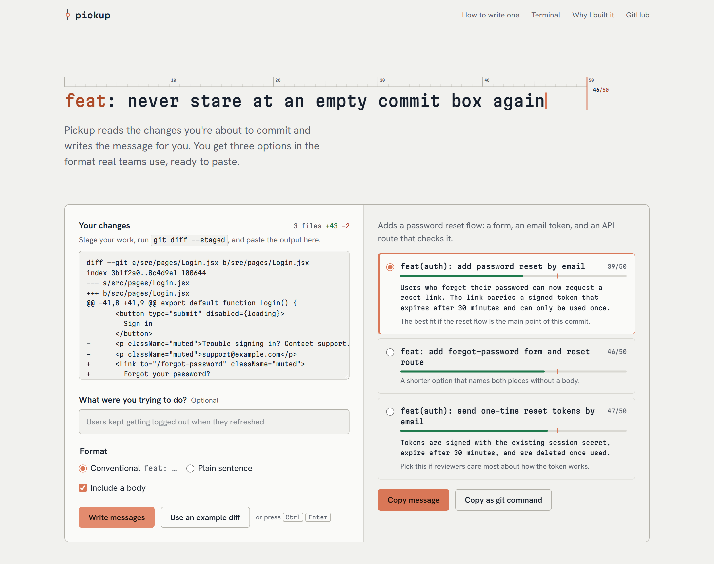

# Pickup

**Turn your git diff into a clear commit message.** Paste your changes into the web page, or run `pickup` in your terminal, and choose from three well-written messages in the format real teams use.



## Why I built this

I write code every day, and the moment that slowed me down most wasn't a failing build. It was the empty commit box. After an hour of work I knew exactly what I'd changed, but putting it into one clear line felt like a second job, so I'd type `update` and push.

A lot of developers are in the same place, especially people who build with AI assistants and ship real projects without ever being taught git's conventions. Their history fills up with `fix stuff` and `final changes`. That makes it hard to review work, find the commit that broke something, or show a project to anyone else.

Pickup closes that gap:

- **It reads the actual diff**, so the message describes what really changed instead of guessing.
- **It follows [Conventional Commits](https://www.conventionalcommits.org/)** and the 50/72 rule, so every message it writes is also an example of how to write one.
- **It stays out of your way.** Stage, run `pickup`, press a number. You keep building, and your history still tells the story of what you built.

## What it does

| | |
|---|---|
| **Three options, not one** | One message focused on the main change, one broader, one more specific. Pick whichever fits. |
| **Explains itself** | A plain-language summary of the diff, and a note on when each option is the right pick. |
| **Teaches the format** | Each subject line gets a length meter with the 50-character guide, so you learn the rule by seeing it. |
| **Flags mixed commits** | If a diff mixes unrelated changes, Pickup suggests splitting them. |
| **Uses your intent** | An optional "what were you trying to do?" hint turns into a better explanation of *why*. |
| **Guides beginners** | A **How to use** panel walks through the whole flow as a timeline, from `git add` to `git push`, with a copy button on every command. |
| **Works where you work** | A web page for pasting, and a CLI that commits for you. Both share the same core. |

## Quick start

You'll need [Node.js](https://nodejs.org) 20.12 or newer and at least one AI key: an [OpenAI API key](https://platform.openai.com/api-keys) (pay-as-you-go, needs [billing](https://platform.openai.com/settings/organization/billing)), a [Gemini API key](https://aistudio.google.com/apikey) (has a free tier), or both. With both, Gemini takes over automatically when OpenAI runs out of credit.

```bash
git clone https://github.com/satyaidk/pickup.git
cd pickup
npm install
cp .env.example .env        # then add OPENAI_API_KEY, GEMINI_API_KEY, or both
npm run dev                 # open http://127.0.0.1:5173
```

No key yet? `npm run demo` starts the page with example output, so you can try the whole flow without making API calls.

| Script | What it does |
|---|---|
| `npm run dev` | API server plus the React app with hot reload, on one port |
| `npm run demo` | Same, with example output instead of API calls |
| `npm run build` | Builds the React app into `dist/` |
| `npm start` | Serves the production build and the API |

## Use it from your terminal

Link the CLI once, then use it in any repository:

```bash
npm link                    # run inside the pickup folder

cd ~/code/my-project
git add .
pickup
```

```
Adds a password reset flow: a form, an email token, and an API route.

[1] feat(auth): add password reset by email  39 chars
    Users who forget their password can now request a reset link.
    The best fit if the reset flow is the main point.

[2] feat: add forgot-password form and reset route  46 chars
[3] feat(auth): send one-time reset tokens by email  47 chars

Commit with which message? [1-3, or q to quit] 1
[main 4f2a91c] feat(auth): add password reset by email
```

| Option | What it does |
|---|---|
| `--hint "<text>"` | Tell Pickup what you were trying to do |
| `--simple` | Plain subject lines instead of Conventional Commits |
| `--no-body` | Subject lines only |
| `--pick <n>` | Commit with suggestion *n* without asking |
| `--dry-run` | Show suggestions without committing |
| `--demo` | Example output, no API call |

Lockfiles (`package-lock.json`, `yarn.lock` and similar) are left out of what Pickup reads, since they describe dependencies, not intent. They're still committed as normal.

## How it works

```
                                              ┌─▶ OpenAI  (first choice)
 git diff ──▶ src/generate.js ──▶ router ────┤
                ▲          ▲                  └─▶ Gemini  (backup, when OpenAI fails)
   src/server.js          bin/pickup.js
   (React app + /api)     (terminal)            ──▶ { summary, candidates[3], split_hint }
```

- **`src/generate.js`** is the core. It builds the instructions that set the rules: imperative mood, subject under 50 characters, body wrapped at 72, never invent tickets or motivations the diff doesn't show. The same JSON schema goes to every provider (OpenAI **Structured Outputs**, Gemini's **response JSON schema**), so the response always has the same shape whichever AI wrote it, and never needs fragile text parsing.
- **`src/providers/`** holds one small module per AI provider (`openai.js`, `gemini.js`) that turns each SDK's errors into one shared shape, plus **`router.js`**, which does the fallback. It tries OpenAI first. If OpenAI is out of credit, rate limited, unreachable or rejects its key, the same request goes to Gemini straight away, and OpenAI is skipped for a while (15 minutes after running out of credit, or exactly as long as a rate limit asks) so later requests don't waste a round trip. When a backup wrote the messages, the page and the CLI say so, and the server logs why it switched.
- **`src/server.js`** is a small Node HTTP server with no framework. It exposes `POST /api/generate` and serves the React app: through Vite with hot reload in development, and from the `dist/` build in production. The API keys stay on the server and never reach the browser.
- **`bin/pickup.js`** reads `git diff --staged`, calls the same core, and commits with `git commit -F -` so multi-line messages are passed exactly.
- **`web/`** is the React app, built with Vite. Each section of the page is its own component, and the logic that doesn't need React (diff stats, length checks, building the `git commit` command) lives in plain functions in `web/src/lib/commit.js`.

Errors are written for the person using the tool: a rejected key, an account out of credit, a rate limit, an empty diff or an oversized diff each get a message that says what happened and what to do next.

### Design

The page is built around the one rule everyone forgets: **keep the subject line under 50 characters.** The headline is itself a commit subject set on an editor's column ruler, with the 50-column guide drawn in. The same guide shows up on every generated message as a length meter, and again in the annotated example lower down. Type is set in Martian Mono for anything git would show you, and Hanken Grotesk for everything else. A single orange accent, borrowed from Claude Code, marks the things you act on: the column guides, the commit type, the selected message and the main buttons. The page supports light and dark mode, works down to phone width, and respects reduced-motion settings.

## Configuration

All settings go in `.env`:

| Variable | Default | |
|---|---|---|
| `OPENAI_API_KEY` | none | At least one of the two keys is required |
| `GEMINI_API_KEY` | none | Backup provider; also works on its own |
| `PICKUP_PROVIDERS` | `openai,gemini` | Order to try providers in |
| `OPENAI_MODEL` | `gpt-5.4-mini` | Any chat model your OpenAI account can use |
| `OPENAI_REASONING_EFFORT` | unset | For reasoning models (gpt-5 and o-series): `low` is faster and cheaper |
| `GEMINI_MODEL` | `gemini-flash-latest` | Any Gemini model your key can use |
| `PORT` | `5173` | Web server port |
| `PICKUP_DEMO` | unset | Set to `1` for example output with no API calls |

> Pickup is meant to run on your own machine. If you deploy the web server publicly, put authentication or rate limiting in front of it, since every request spends your API credits.

## Project structure

```
bin/pickup.js       CLI
src/generate.js     Prompt and schema (shared core)
src/providers/      openai.js, gemini.js and router.js (fallback between them)
src/server.js       Web server and /api/generate
src/env.js          Loads .env from the project folder
web/                React app (Vite)
  src/components/   One component per page section, plus the workbench parts
  src/lib/          commit.js (pure helpers) and api.js (server calls)
  src/data/         Example diff and developer quotes
  src/config.js     Your name and repository links
vite.config.js      Builds web/ into dist/
docs/               README assets
```

## License

MIT
